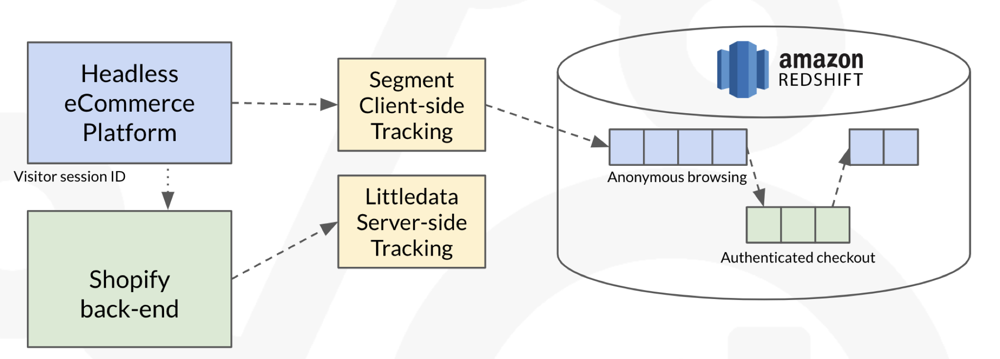

# ra_warehouse_ecommerce

dbt project example that integrates ecommerce data from Shopify, visitor journey website event data + basket checkouts from Segment/Littledata along with ad network data from Google Ads and Fivetran

* Granular, event-level customer + orders data
* Identity-stitches anonymous + logged-in data
* links headless ecommerce website visitor journey events to (shopify headless) checkout events
* Connects to ad network ad/adset/campaign metadata + ad network performance data
* First-click, last-click, even-click and time decay attribution models
* Rapid time-to-value using our pre-build and pre-integrated RA DW framework for dbt
* Assumes use of Segment for replicating Ad Network data into Redshift
* Code example, would need amending & validating for a specific client

## Data Model Diagram

## Use-cases Supported

* CAC/LTV Optimization - identify channels that bring in most valuable converters
* 360-degree view of customer - preferences, signals from website visits, purchases
* Customer LTV optimization, move up value segment and increase repeat purchases
* Funnel analysis, journey vs. ideal - cohorting sample buyers vs. others
* Automated and efficient basic eCommerce reporting

## See also

* [ra_attribution dbt package](https://github.com/rittmananalytics/ra_attribution) for attributing the value of conversions to the marketing touchpoints that led to it
